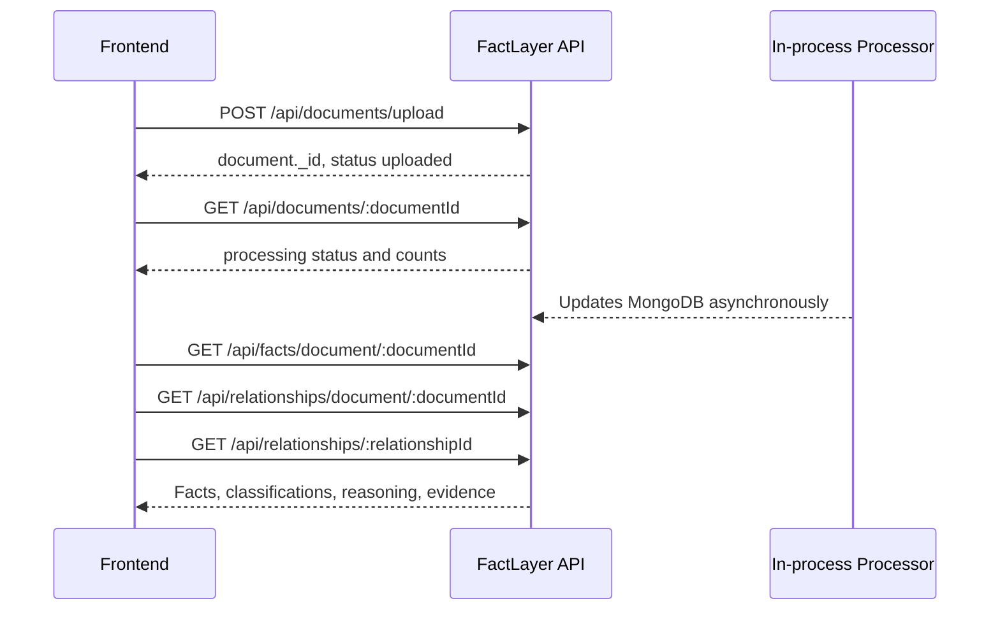

# FactLayer API Contract

This contract describes the current implementation in `index.js`, the route files, controllers, and Mongoose models. Code is the source of truth. There is no authentication or authorization.


## Endpoint Index

| Method | Path | Purpose |
|---|---|---|
| `GET` | `/health` | Liveness check (not workspace-scoped) |
| `POST` | `/api/documents/upload` | Upload 1 to 20 PDFs (`document` field); each starts processing immediately |
| `GET` | `/api/documents` | List documents with progress |
| `GET` | `/api/documents/:documentId` | One document with status, stage, and `progress` |
| `POST` | `/api/documents/:documentId/reprocess` | Resume unfinished pages; `?reset=true` starts over |
| `GET` | `/api/documents/:documentId/pages` | Page text in order |
| `GET` | `/api/documents/:documentId/chunks` | Chunks (page-sized passages) in order |
| `GET` | `/api/pages/:pageId` | One page |
| `GET` | `/api/chunks/:chunkId` | One chunk with document and page populated |
| `GET` | `/api/search/chunks?q=&topK=` | Semantic passage search |
| `GET` | `/api/facts/document/:documentId` | Facts of a document |
| `GET` | `/api/facts/:factId` | One fact with document, page, and chunk populated |
| `GET` | `/api/facts/search?q=&topK=` | Semantic fact search |
| `GET` | `/api/relationships/document/:documentId` | Relationships touching a document's facts |
| `GET` | `/api/relationships/:relationshipId` | One relationship with both facts populated |
| `POST` | `/api/ask` | Cited answer across all documents (`{ question, topK }`; `GET /api/ask?q=` also works) |
| `GET` | `/api/showcase` | Best real example of each of the four assignment cases |
| `GET` | `/api/providers` | Configured language model providers and their availability |

## API Base Information

- Base URL: `http://localhost:3000`
- API prefix: `/api`
- JSON endpoints use `Content-Type: application/json` for responses.
- Upload uses `multipart/form-data`.
- CORS accepts `localhost`, any `*.vercel.app` origin (including preview deployments), and ngrok tunnels; `ALLOWED_ORIGINS` adds more, and `*` disables the check. The `x-factlayer-user` and `ngrok-skip-browser-warning` request headers are allowed, and the rate limit headers are exposed to the browser.
- There is no API version prefix, bearer token, API key, session, or authorization header.
- Successful controller responses use HTTP `200` and the `SuccessResponse` envelope below. `/health` is the only endpoint with a different response shape.
- Collection endpoints have no pagination, filtering, or sorting query parameters unless explicitly documented. Document facts and relationships are sorted by `createdAt` in the backend; pages/chunks are sorted by source order.

## Workspaces

Every `/api` request is scoped to a **workspace** named by the `x-factlayer-user` header (or a `?workspace=` query parameter). A workspace holds its own documents, facts, relationships, extraction issues and vector namespaces, so search, answers and the four cases never reach across workspaces. Requests without the header use the workspace `demo`.

```http
x-factlayer-user: joseph
```

Names are lowercased and trimmed, may contain letters, digits, spaces, dots, dashes and underscores, must start with a letter or digit, and are capped at 40 characters. An unusable name falls back to `demo`.

This is **not authentication**. There is no password and no ownership proof: anyone who sends the same name gets that workspace. It exists so a person can close the app and come back to their own documents, not to protect data. Requesting another workspace's document, facts, relationships, pages or chunks returns `404 Document not found`.

## Rate Limits

The endpoints that call a language model are limited per workspace: `POST /api/ask` and `GET /api/ask` allow 10 questions per minute, and `POST /api/documents/upload` and `POST /api/documents/:documentId/reprocess` allow 10 per minute. Every response carries `X-RateLimit-Limit`, `X-RateLimit-Remaining` and `X-RateLimit-Reset`; a refused request returns `429` with `Retry-After` and the message `Too many questions. You can send 10 every 60s; try again in Ns.` Limits live in process memory and reset when the server restarts. `ASK_RATE_MAX`, `ASK_RATE_WINDOW_MS`, `UPLOAD_RATE_MAX` and `UPLOAD_RATE_WINDOW_MS` configure them.

## Language Model Providers

Fact extraction, primary entity detection, pair adjudication and answers all run through one provider layer with automatic failover. `LLM_PROVIDER` names the preferred provider (`minimax` by default, with `FACT_EXTRACTION_MODEL`); the other configured provider (`gemini`, with `GEMINI_MODEL`) takes over while the first is rate limited, and the preferred one resumes once its cooldown expires. Because each call is one unit of work, a switch continues from the current page or batch rather than restarting the document. While both providers are limited a call waits and keeps cycling them, up to `LLM_RATE_LIMIT_BUDGET_MS` (five minutes by default), so a page is delayed rather than lost. Facts record the model that produced them in `extractionModel`, so a document processed across a failover shows both.

### `GET /api/providers`

Reports each configured provider, its model, whether it is currently available, and how many seconds remain on a cooldown.

```json
{ "providers": [
  { "provider": "minimax", "model": "MiniMax-M3", "available": true, "availableInSeconds": 0 },
  { "provider": "gemini", "model": "gemini-2.5-flash", "available": false, "availableInSeconds": 42 }
] }
```

`POST /api/ask` responses also include `provider` and `model` naming which one answered.

## Global Headers

For GET requests, no request headers are required beyond the workspace header. The response is JSON.

For document upload:

```http
Content-Type: multipart/form-data
```

Do not manually set the multipart boundary when using browser `FormData`; let the client runtime set it. Uploads are staged on disk in `UPLOAD_DIR`, falling back to the project `uploads/` folder and then the system temp directory.

## Standard Response Format

All controller success responses use this exact shape:

```json
{
  "statusCode": 200,
  "message": "Human-readable result message",
  "data": {},
  "success": true
}
```

| Field | Type | Meaning |
|---|---|---|
| `statusCode` | Number | HTTP status code, currently `200` for controller success |
| `message` | String | Result message generated by the controller |
| `data` | Object | Endpoint-specific payload |
| `success` | Boolean | `true` when status is between 200 and 399 |

## Global Error Format

Application errors use the same class-generated envelope:

```json
{
  "statusCode": 400,
  "message": "Invalid document ID",
  "data": {},
  "success": false
}
```

`data` defaults to an empty object for errors raised through `ApiError`. Multer errors are converted to HTTP `400`. Other uncaught errors default to HTTP `500` and use the error message. Unknown Express routes do not currently have a dedicated JSON 404 handler and should not be assumed to use this envelope.

Common error messages include:

- `At least one PDF file is required in the document field`
- `Upload at most 20 PDF files per request in the document field`
- `Document is already being processed`
- `A question is required (body.question or ?q=)`
- `topK must be an integer between 1 and 30`
- `Too many questions. You can send 10 every 60s; try again in Ns.`
- `Too many uploads. You can send 10 every 60s; try again in Ns.`
- `Only PDF files are allowed`
- `File size must not exceed 200 MB`
- `Invalid document ID`
- `Invalid page ID`
- `Invalid chunk ID`
- `Invalid fact ID`
- `Invalid relationship ID`
- `Document not found`
- `Page not found`
- `Chunk not found`
- `Fact not found`
- `Relationship not found`
- `The q query parameter is required`
- `topK must be an integer between 1 and 100`

## Enumerations

### Document status

- `uploaded`: S3 upload completed and background processing is about to start.
- `processing`: processing is running; `processingStage`, `processedChunkCount`, `chunkCount`, and `factCount` report progress.
- `processed`: pages, chunks, embeddings, facts, relationships, and explanations completed without a caught error.
- `failed`: a pipeline operation failed; `processingError` contains the caught message. `POST /api/documents/:documentId/reprocess` resumes it.

### Relationship classification

The persisted `relationshipType` and `classification` can be:

- `candidate`
- `corroborated`
- `contradiction`
- `contextual_difference`
- `uncertain`

Candidate records are created by semantic retrieval. The processor then reconciles them and normally sets `status` to `reviewed` with one of the four reconciliation classifications. `candidate` remains a valid schema value.

### Relationship status

- `pending`: default relationship status before reconciliation.
- `reviewed`: set by reconciliation after classification.

## Object Schemas

All Mongoose documents include `_id`, `createdAt`, `updatedAt`, and `__v` unless noted otherwise. ObjectId values are serialized as 24-character hexadecimal strings in JSON.

### Document

| Field | Type | Required | Nullable | Description |
|---|---|---:|---:|---|
| `_id` | String/ObjectId | Yes | No | MongoDB identifier |
| `originalFileName` | String | Yes | No | Uploaded filename |
| `s3Key` | String | Yes | No | Private S3 key, normally `documents/{documentId}/original.pdf` |
| `mimeType` | String | Yes | No | Always `application/pdf` by schema |
| `fileSize` | Number | Yes | No | Uploaded bytes |
| `status` | String | Yes | No | Document processing state |
| `pageCount` | Number | No | No | Defaults to `0` |
| `chunkCount` | Number | No | No | Defaults to `0` |
| `processingError` | String | No | Yes | Error message or `null` |
| `createdAt` | ISO date string | Yes | No | Mongoose timestamp |
| `updatedAt` | ISO date string | Yes | No | Mongoose timestamp |
| `__v` | Number | Yes | No | Mongoose version field |

### Page

| Field | Type | Required | Nullable | Description |
|---|---|---:|---:|---|
| `_id` | String/ObjectId | Yes | No | Page identifier |
| `documentId` | String/ObjectId | Yes | No | Parent document ID |
| `pageNumber` | Number | Yes | No | Original PDF page number |
| `text` | String | No | No | Extracted page text; default empty string |
| `createdAt` | ISO date string | Yes | No | Mongoose timestamp |
| `updatedAt` | ISO date string | Yes | No | Mongoose timestamp |
| `__v` | Number | Yes | No | Mongoose version field |

### Chunk

| Field | Type | Required | Nullable | Description |
|---|---|---:|---:|---|
| `_id` | String/ObjectId | Yes | No | Chunk identifier |
| `documentId` | String/ObjectId or populated Document | Yes | No | Parent document reference |
| `pageId` | String/ObjectId or populated Page | Yes | No | Parent page reference |
| `pageNumber` | Number | Yes | No | Source page number |
| `chunkIndex` | Number | Yes | No | Chunk order within page |
| `text` | String | Yes | No | Chunk source text |
| `tokenCount` | Number | Yes | No | Whitespace-separated word count |
| `vectorId` | String | Yes | No | Pinecone chunk vector ID |
| `createdAt` | ISO date string | Yes | No | Mongoose timestamp |
| `updatedAt` | ISO date string | Yes | No | Mongoose timestamp |
| `__v` | Number | Yes | No | Mongoose version field |

### Fact record

In `GET /api/facts/document/:documentId`, fact references are ObjectId strings. In `GET /api/facts/:factId` and relationship responses, `documentId`, `pageId`, and `chunkId` are populated objects.

| Field | Type | Required | Nullable | Description |
|---|---|---:|---:|---|
| `_id` | String/ObjectId | Yes | No | Fact identifier |
| `documentId` | String/ObjectId or Document | Yes | No | Source document |
| `pageId` | String/ObjectId or Page | Yes | No | Source page |
| `chunkId` | String/ObjectId or Chunk | Yes | No | Source chunk |
| `pageNumber` | Number | No | Yes | Source page number copied during extraction |
| `subject` | String | Yes | No | Raw extracted subject |
| `predicate` | String | Yes | No | Raw extracted predicate |
| `object` | Any/Mixed | No | Yes | Optional extracted object |
| `value` | Any/Mixed | No | Yes | Raw extracted value |
| `valueType` | String | No | Yes | Value type such as `number` or `percentage` |
| `unit` | String | No | Yes | Raw unit |
| `currency` | String | No | Yes | Raw currency |
| `period` | String | No | Yes | Raw period label |
| `periodStart` | ISO date string | No | Yes | Raw/compatible period start when available |
| `periodEnd` | ISO date string | No | Yes | Raw/compatible period end when available |
| `scope` | String | No | Yes | Raw scope |
| `sourceText` | String | Yes | No | Evidence span copied from the chunk |
| `evidenceStart` | Number | No | Yes | Defined by schema but not currently populated |
| `evidenceEnd` | Number | No | Yes | Defined by schema but not currently populated |
| `confidence` | Number | Yes | No | LLM confidence between `0` and `1` |
| `extractionModel` | String | Yes | No | Configured extraction model name |
| `rawSubject` | String | No | Yes | Preserved raw subject |
| `rawPredicate` | String | No | Yes | Preserved raw predicate |
| `rawValue` | Any/Mixed | No | Yes | Preserved raw value |
| `rawUnit` | String | No | Yes | Preserved raw unit |
| `rawCurrency` | String | No | Yes | Preserved raw currency |
| `rawPeriod` | String | No | Yes | Preserved raw period |
| `rawScope` | String | No | Yes | Preserved raw scope |
| `normalizedSubject` | String | No | Yes | Canonical subject |
| `normalizedPredicate` | String | No | Yes | Canonical predicate |
| `normalizedObject` | Any/Mixed | No | Yes | Canonical object |
| `normalizedValue` | Number | No | Yes | Canonical numeric value |
| `normalizedPercentage` | Number | No | Yes | Canonical percentage as decimal when recognized |
| `normalizedUnit` | String | No | Yes | Canonical unit |
| `normalizedCurrency` | String | No | Yes | Canonical currency code |
| `normalizedScope` | String | No | Yes | Canonical scope |
| `periodType` | String | No | Yes | Canonical period type |
| `normalizedPeriodStart` | ISO date string | No | Yes | Canonical period start |
| `normalizedPeriodEnd` | ISO date string | No | Yes | Canonical period end |
| `periodLabel` | String | No | Yes | Canonical period label |
| `createdAt` | ISO date string | Yes | No | Mongoose timestamp |
| `updatedAt` | ISO date string | Yes | No | Mongoose timestamp |
| `__v` | Number | Yes | No | Mongoose version field |

### Evidence

Evidence is returned inside relationship `evidence[]` and is also represented by `sourceEvidence` in detail endpoints.

| Field | Type | Nullable | Description |
|---|---|---:|---|
| `fact` | String | No | `Fact A` or `Fact B` |
| `documentId` | String/ObjectId | Yes | Source document ID |
| `pageId` | String/ObjectId | Yes | Source page ID |
| `pageNumber` | Number | Yes | Source page number, if available |
| `chunkId` | String/ObjectId | Yes | Source chunk ID |
| `sourceText` | String | Yes | Exact or near-exact evidence text |
| `evidenceAvailable` | Boolean | No | Whether all required evidence references exist |

### Relationship

| Field | Type | Required | Nullable | Description |
|---|---|---:|---:|---|
| `_id` | String/ObjectId | Yes | No | Relationship identifier |
| `factA` | String/ObjectId or populated Fact | Yes | No | Canonically ordered first fact |
| `factB` | String/ObjectId or populated Fact | Yes | No | Canonically ordered second fact |
| `relationshipType` | String | Yes | No | Candidate or final classification |
| `similarityScore` | Number | Yes | No | Pinecone similarity score |
| `matchingScore` | Number | Yes | No | Compatibility-adjusted score |
| `confidence` | Number | Yes | No | Classification confidence |
| `reason` | String | Yes | No | Short deterministic reason |
| `context` | String | No | Yes | Contextual difference details |
| `comparisonSignals` | Object/Mixed | No | No | Signals such as same period, scope, unit, currency, and value difference |
| `evidence` | Evidence[] | No | No | Fact A and Fact B evidence references |
| `summary` | String | No | Yes | Explanation summary |
| `detailedReason` | String | No | Yes | Explanation grounded in both source texts |
| `classification` | String | No | Yes | Final classification copy |
| `keyDifferences` | String[] | No | No | Explanation differences |
| `keySimilarities` | String[] | No | No | Explanation similarities |
| `status` | String | No | No | `pending` or `reviewed` |
| `createdAt` | ISO date string | Yes | No | Mongoose timestamp |
| `updatedAt` | ISO date string | Yes | No | Mongoose timestamp |
| `__v` | Number | Yes | No | Mongoose version field |

## Endpoint Reference

### GET /health

#### Purpose

Checks that the Express process is running. It does not verify MongoDB, S3, Pinecone, or MiniMax.

#### Headers

None required.

#### Request body

None.

#### Success response

HTTP `200`, not the standard `ApiResponse` envelope:

```json
{
  "status": "UP",
  "timestamp": "2026-09-07T12:00:00.000Z",
  "uptime": 42.12
}
```

| Field | Type | Description |
|---|---|---|
| `status` | String | Always `UP` when the handler runs |
| `timestamp` | ISO date string | Current server time |
| `uptime` | Number | Node process uptime in seconds |

---

### POST /api/documents/upload

#### Purpose

Accepts one or more PDFs (up to 20 files in the `document` field, `documents` is also accepted), stores each in S3, creates document metadata in MongoDB, starts background processing in the API process, and returns without waiting for extraction or embeddings.

#### Headers

| Header | Required | Value |
|---|---:|---|
| `Content-Type` | Yes | `multipart/form-data` with a boundary generated by the client |
| Authentication | No | No authentication is implemented |

#### Request body

Content type: `multipart/form-data`.

| Field | Type | Required | Description |
|---|---|---:|---|
| `document` | File | Yes | PDF file; the only accepted upload field |

#### Validation

- MIME type must be `application/pdf`.
- Filename must end with `.pdf`, case-insensitive.
- Maximum size is 200 MB.
- The upload is stored temporarily on disk under `uploads/`, streamed to S3, and removed afterward.
- File contents are not independently checked against a PDF magic number.
- Missing field returns HTTP `400` with `A PDF file is required in the document field`.

#### Example request

```sh
curl -X POST http://localhost:3000/api/documents/upload \
  -F "document=@./sample.pdf"
```

#### Success response

HTTP `200`:

```json
{
  "statusCode": 200,
  "message": "Document uploaded successfully",
  "data": {
    "document": {
      "_id": "66f1a2b3c4d5e6f7890a1234",
      "originalFileName": "sample.pdf",
      "s3Key": "documents/66f1a2b3c4d5e6f7890a1234/original.pdf",
      "mimeType": "application/pdf",
      "fileSize": 24576,
      "status": "uploaded",
      "pageCount": 0,
      "chunkCount": 0,
      "processingError": null,
      "createdAt": "2026-09-07T12:00:00.000Z",
      "updatedAt": "2026-09-07T12:00:00.000Z",
      "__v": 0
    }
  },
  "success": true
}
```

#### Status codes

| Status | Meaning |
|---:|---|
| `200` | S3 upload and MongoDB save completed; processing started |
| `400` | Missing file, invalid MIME/extension, or Multer validation failure |
| `500` | S3 or MongoDB failure |

#### Frontend usage

Store `data.document._id` and poll `GET /api/documents/:documentId`. The initial status is `uploaded`; the endpoint does not wait for `processed`.

---

### GET /api/documents/:documentId

#### Purpose

Returns document metadata and current processing status.

#### Parameters

| Parameter | Location | Required | Type |
|---|---|---:|---|
| `documentId` | Path | Yes | MongoDB ObjectId string |

#### Request body

None.

#### Example

```sh
curl http://localhost:3000/api/documents/66f1a2b3c4d5e6f7890a1234
```

#### Success response

HTTP `200` with `data.document` matching the Document schema.

#### Status codes

- `200`: document returned.
- `400`: invalid ObjectId, message `Invalid document ID`.
- `404`: valid ID not found, message `Document not found`.
- `500`: database failure.

---

### GET /api/documents/:documentId/pages

#### Purpose

Returns all persisted pages for a document in ascending `pageNumber` order.

#### Parameters and body

`documentId` is a required MongoDB ObjectId path parameter. No body, headers, pagination, or filtering.

#### Example

```sh
curl http://localhost:3000/api/documents/66f1a2b3c4d5e6f7890a1234/pages
```

#### Success response

HTTP `200`:

```json
{
  "statusCode": 200,
  "message": "Document pages retrieved successfully",
  "data": {
    "pages": [
      {
        "_id": "66f1a2b3c4d5e6f7890a2001",
        "documentId": "66f1a2b3c4d5e6f7890a1234",
        "pageNumber": 1,
        "text": "Revenue was $120M.",
        "createdAt": "2026-09-07T12:01:00.000Z",
        "updatedAt": "2026-09-07T12:01:00.000Z",
        "__v": 0
      }
    ]
  },
  "success": true
}
```

A valid but nonexistent document returns `200` with `pages: []`; the controller does not verify the parent document exists. Invalid ID returns `400`.

---

### GET /api/documents/:documentId/chunks

#### Purpose

Returns all persisted chunks for a document, sorted by `pageNumber` and `chunkIndex`.

#### Parameters and body

`documentId` is a required MongoDB ObjectId path parameter. No body, headers, pagination, or filtering.

#### Example

```sh
curl http://localhost:3000/api/documents/66f1a2b3c4d5e6f7890a1234/chunks
```

#### Success response

HTTP `200` with `data.chunks`, an array of Chunk records with unpopulated `documentId` and `pageId` strings. A valid but nonexistent document returns `chunks: []`; invalid ID returns `400`.

---

### GET /api/pages/:pageId

#### Purpose

Returns one page record.

#### Parameters and body

`pageId` is a required MongoDB ObjectId path parameter. No body.

#### Example

```sh
curl http://localhost:3000/api/pages/66f1a2b3c4d5e6f7890a2001
```

#### Success response

HTTP `200` with `data.page` matching the Page schema.

#### Status codes

- `200`: page returned.
- `400`: invalid page ID.
- `404`: page not found.
- `500`: database failure.

---

### GET /api/chunks/:chunkId

#### Purpose

Returns a chunk and its populated source document and page references.

#### Parameters and body

`chunkId` is a required MongoDB ObjectId path parameter. No body.

#### Example

```sh
curl http://localhost:3000/api/chunks/66f1a2b3c4d5e6f7890a3001
```

#### Success response

HTTP `200`:

```json
{
  "statusCode": 200,
  "message": "Chunk retrieved successfully",
  "data": {
    "chunk": { "_id": "66f1a2b3c4d5e6f7890a3001", "documentId": {}, "pageId": {}, "pageNumber": 1, "chunkIndex": 0, "text": "Revenue was $120M.", "tokenCount": 4, "vectorId": "chunk_66f1a2b3c4d5e6f7890a1234_1_0", "createdAt": "2026-09-07T12:01:00.000Z", "updatedAt": "2026-09-07T12:01:00.000Z", "__v": 0 },
    "sourceDocument": {},
    "page": {},
    "sourceEvidence": "Revenue was $120M."
  },
  "success": true
}
```

`sourceDocument` and `page` are populated Mongoose objects. Statuses: `200`, `400` invalid ID, `404` missing chunk, `500` database failure.

---

### GET /api/facts/document/:documentId

#### Purpose

Returns facts extracted from one document, sorted by `createdAt` ascending.

#### Parameters and body

`documentId` is a required MongoDB ObjectId path parameter. No body, pagination, or filtering.

#### Example

```sh
curl http://localhost:3000/api/facts/document/66f1a2b3c4d5e6f7890a1234
```

#### Success response

HTTP `200` with `data.facts`. Fact `documentId`, `pageId`, and `chunkId` are not populated and are serialized references.

A valid but nonexistent document returns `facts: []`; invalid ID returns `400`.

---

### GET /api/facts/:factId

#### Purpose

Returns one fact plus populated source document, page, chunk, and source evidence.

#### Parameters and body

`factId` is a required MongoDB ObjectId path parameter. No body.

#### Example

```sh
curl http://localhost:3000/api/facts/66f1a2b3c4d5e6f7890a4001
```

#### Success response

HTTP `200` with:

```json
{
  "statusCode": 200,
  "message": "Fact retrieved successfully",
  "data": {
    "fact": {
      "_id": "66f1a2b3c4d5e6f7890a4001",
      "documentId": {},
      "pageId": {},
      "chunkId": {},
      "pageNumber": 1,
      "subject": "Company",
      "predicate": "revenue",
      "object": null,
      "value": "$120M",
      "valueType": "number",
      "unit": "USD",
      "currency": "USD",
      "period": "FY2024",
      "periodStart": null,
      "periodEnd": null,
      "scope": "global",
      "sourceText": "Revenue was $120M.",
      "evidenceStart": null,
      "evidenceEnd": null,
      "confidence": 0.95,
      "extractionModel": "MiniMax-M3",
      "rawSubject": "Company",
      "rawPredicate": "revenue",
      "rawValue": "$120M",
      "rawUnit": null,
      "rawCurrency": null,
      "rawPeriod": "FY2024",
      "rawScope": "global",
      "normalizedSubject": "company",
      "normalizedPredicate": "revenue",
      "normalizedObject": null,
      "normalizedValue": 120000000,
      "normalizedPercentage": null,
      "normalizedUnit": "currency",
      "normalizedCurrency": "USD",
      "normalizedScope": "global",
      "periodType": "fiscalYear",
      "normalizedPeriodStart": "2024-01-01T00:00:00.000Z",
      "normalizedPeriodEnd": "2024-12-31T00:00:00.000Z",
      "periodLabel": "FY2024",
      "createdAt": "2026-09-07T12:01:00.000Z",
      "updatedAt": "2026-09-07T12:01:00.000Z",
      "__v": 0
    },
    "sourceDocument": {},
    "page": {},
    "chunk": {},
    "sourceEvidence": "Revenue was $120M."
  },
  "success": true
}
```

The `{}` values above are populated Document, Page, and Chunk objects whose exact fields are defined in Object Schemas. Statuses: `200`, `400` invalid ID, `404` missing fact, `500` database failure.

---

### GET /api/facts/search

#### Purpose

Embeds a natural-language query, searches the Pinecone `facts` namespace, then hydrates matching canonical facts from MongoDB. Results preserve Pinecone match order and include a score.

#### Query parameters

| Parameter | Required | Type | Rules |
|---|---:|---|---|
| `q` | Yes | String | Trimmed natural-language query; empty is `400` |
| `topK` | No | Integer | Default `10`; allowed range `1..100` |

#### Example

```sh
curl "http://localhost:3000/api/facts/search?q=How%20many%20employees%20did%20the%20company%20have%3F&topK=10"
```

#### Success response

HTTP `200`:

```json
{
  "statusCode": 200,
  "message": "Fact search completed successfully",
  "data": {
    "query": "How many employees did the company have?",
    "results": [
      {
        "score": 0.91,
        "fact": { "_id": "66f1a2b3c4d5e6f7890a4001" }
      }
    ]
  },
  "success": true
}
```

The real `fact` object is the full Fact record with populated document/page/chunk references because search uses Mongoose `populate`. Pinecone matches whose metadata IDs are not valid MongoDB ObjectIds or whose records are absent in MongoDB are omitted. Statuses: `200`, `400` missing/invalid query, `500` embedding/Pinecone/MongoDB failure.

---

### GET /api/search/chunks

#### Purpose

Embeds a natural-language query, searches the configured chunk namespace (`PINECONE_NAMESPACE`, default `factlayer`), and hydrates matching canonical chunks from MongoDB.

#### Query parameters

`q` is required and non-empty. `topK` defaults to `10` and must be an integer from `1` to `100`.

#### Example

```sh
curl "http://localhost:3000/api/search/chunks?q=company%20workforce&topK=10"
```

#### Success response

HTTP `200` with `data.query` and `data.results`. Each result is `{ "score": Number, "chunk": Chunk }`, where `documentId` and `pageId` are populated. Missing MongoDB records are omitted. Statuses: `200`, `400` invalid query/topK, `500` embedding/Pinecone/MongoDB failure.

---

### GET /api/relationships/document/:documentId

#### Purpose

Returns all relationships where either fact belongs to the requested document. Both facts and each fact's document/page/chunk references are populated.

#### Parameters and body

`documentId` is a required MongoDB ObjectId path parameter. No body, pagination, filtering, or query parameters.

#### Example

```sh
curl http://localhost:3000/api/relationships/document/66f1a2b3c4d5e6f7890a1234
```

#### Success response

HTTP `200` with `data.relationships`, sorted by `createdAt` ascending. A valid document with no facts or relationships returns an empty array. Invalid ID returns `400`.

---

### GET /api/relationships/:relationshipId

#### Purpose

Returns one relationship and its populated Fact A/Fact B evidence paths.

#### Parameters and body

`relationshipId` is a required MongoDB ObjectId path parameter. No body.

#### Example

```sh
curl http://localhost:3000/api/relationships/66f1a2b3c4d5e6f7890a5001
```

#### Success response

HTTP `200`:

```json
{
  "statusCode": 200,
  "message": "Relationship retrieved successfully",
  "data": {
    "relationship": {
      "_id": "66f1a2b3c4d5e6f7890a5001",
      "factA": {},
      "factB": {},
      "relationshipType": "contextual_difference",
      "similarityScore": 0.91,
      "matchingScore": 0.91,
      "confidence": 0.88,
      "reason": "Facts share the same metric but period differs.",
      "context": "period differs",
      "comparisonSignals": {
        "sameSubject": true,
        "samePredicate": true,
        "samePeriod": false,
        "sameScope": true,
        "sameUnit": true,
        "sameCurrency": true,
        "valueDifference": 68000000,
        "percentageDifference": 0.68,
        "valuesEqualWithinTolerance": false,
        "semanticSimilarity": 0.91
      },
      "evidence": [
        { "fact": "Fact A", "documentId": "66f1...", "pageId": "66f2...", "pageNumber": 4, "chunkId": "66f3...", "sourceText": "FY2024 revenue was $100M.", "evidenceAvailable": true },
        { "fact": "Fact B", "documentId": "66f4...", "pageId": "66f5...", "pageNumber": 8, "chunkId": "66f6...", "sourceText": "Q4 2024 revenue was $32M.", "evidenceAvailable": true }
      ],
      "summary": "contextual_difference: The facts describe the same subject and metric, but their period, scope, unit, or currency context differs; this is not treated as a contradiction.",
      "detailedReason": "Fact A states: 'FY2024 revenue was $100M.' Fact B states: 'Q4 2024 revenue was $32M.' The facts describe the same subject and metric, but their period, scope, unit, or currency context differs; this is not treated as a contradiction.",
      "classification": "contextual_difference",
      "keyDifferences": ["Periods differ: Fact A is 'FY2024'; Fact B is 'Q4 2024'."],
      "keySimilarities": ["Both describe subject 'company'.", "Both describe metric 'revenue'."],
      "status": "reviewed",
      "createdAt": "2026-09-07T12:02:00.000Z",
      "updatedAt": "2026-09-07T12:02:00.000Z",
      "__v": 0
    },
    "factA": {},
    "factB": {},
    "similarity": 0.91,
    "reason": "Facts share the same metric but period differs."
  },
  "success": true
}
```

`factA` and `factB` at the top of `data` are aliases of `relationship.factA` and `relationship.factB`. Statuses: `200`, `400` invalid ID, `404` relationship not found, `500` database failure.

## Frontend Processing State

| State | UI meaning | Recommended UI | Available API action |
|---|---|---|---|
| `uploaded` | File is stored, processing starting | Show uploaded state | Poll `GET /api/documents/:documentId` |
| `processing` | Parsing/extracting | Show `processingStage` and `processedChunkCount`/`chunkCount` | Poll the same document endpoint |
| `processed` | Current pipeline completed | Show counts and enable facts/relationships/evidence views | Call facts, relationships, pages, chunks, and search endpoints |
| `failed` | A pipeline step failed | Show `processingError` and failure state | `POST /api/documents/:documentId/reprocess` to resume |

The API does not provide a progress percentage, cancel endpoint, retry endpoint, or websocket/SSE stream. Polling is the only implemented status observation mechanism.

## Frontend Data Flow



## Recommended Frontend Components

| Component | API source |
|---|---|
| `DocumentUpload` | `POST /api/documents/upload` |
| `DocumentStatus` | `GET /api/documents/:documentId` |
| `PageList` | `GET /api/documents/:documentId/pages` |
| `ChunkList` | `GET /api/documents/:documentId/chunks` |
| `FactTable` | `GET /api/facts/document/:documentId` |
| `FactSearch` | `GET /api/facts/search?q=...&topK=...` |
| `FactDetail` | `GET /api/facts/:factId` |
| `ChunkSearch` | `GET /api/search/chunks?q=...&topK=...` |
| `RelationshipList` | `GET /api/relationships/document/:documentId` |
| `RelationshipDetail` | `GET /api/relationships/:relationshipId` |
| `EvidencePanel` | Fact/relationship response evidence fields; direct page/chunk APIs when needed |

## TypeScript-Like Interfaces

```ts
type ObjectId = string;
type Nullable<T> = T | null;

interface SuccessResponse<T> {
  statusCode: number;
  message: string;
  data: T;
  success: true;
}

interface ErrorResponse {
  statusCode: number;
  message: string;
  data: Record<string, unknown>;
  success: false;
}

interface Document {
  _id: ObjectId;
  originalFileName: string;
  s3Key: string;
  mimeType: "application/pdf";
  fileSize: number;
  status: "uploaded" | "processing" | "processed" | "failed";
  pageCount: number;
  chunkCount: number;
  processingError: Nullable<string>;
  createdAt: string;
  updatedAt: string;
  __v: number;
}

interface Page {
  _id: ObjectId;
  documentId: ObjectId;
  pageNumber: number;
  text: string;
  createdAt: string;
  updatedAt: string;
  __v: number;
}

interface Chunk {
  _id: ObjectId;
  documentId: ObjectId | Document;
  pageId: ObjectId | Page;
  pageNumber: number;
  chunkIndex: number;
  text: string;
  tokenCount: number;
  vectorId: string;
  createdAt: string;
  updatedAt: string;
  __v: number;
}

interface Fact {
  _id: ObjectId;
  documentId: ObjectId | Document;
  pageId: ObjectId | Page;
  chunkId: ObjectId | Chunk;
  pageNumber: Nullable<number>;
  subject: string;
  predicate: string;
  object: unknown | null;
  value: unknown | null;
  valueType: Nullable<string>;
  unit: Nullable<string>;
  currency: Nullable<string>;
  period: Nullable<string>;
  periodStart: Nullable<string>;
  periodEnd: Nullable<string>;
  scope: Nullable<string>;
  sourceText: string;
  evidenceStart: Nullable<number>;
  evidenceEnd: Nullable<number>;
  confidence: number;
  extractionModel: string;
  rawSubject: Nullable<string>;
  rawPredicate: Nullable<string>;
  rawValue: unknown | null;
  rawUnit: Nullable<string>;
  rawCurrency: Nullable<string>;
  rawPeriod: Nullable<string>;
  rawScope: Nullable<string>;
  normalizedSubject: Nullable<string>;
  normalizedPredicate: Nullable<string>;
  normalizedObject: unknown | null;
  normalizedValue: Nullable<number>;
  normalizedPercentage: Nullable<number>;
  normalizedUnit: Nullable<string>;
  normalizedCurrency: Nullable<string>;
  normalizedScope: Nullable<string>;
  periodType: Nullable<string>;
  normalizedPeriodStart: Nullable<string>;
  normalizedPeriodEnd: Nullable<string>;
  periodLabel: Nullable<string>;
  createdAt: string;
  updatedAt: string;
  __v: number;
}

interface Evidence {
  fact: "Fact A" | "Fact B";
  documentId: Nullable<ObjectId>;
  pageId: Nullable<ObjectId>;
  pageNumber: Nullable<number>;
  chunkId: Nullable<ObjectId>;
  sourceText: Nullable<string>;
  evidenceAvailable: boolean;
}

interface ComparisonSignals {
  sameSubject: boolean;
  samePredicate: boolean;
  samePeriod: boolean | null;
  sameScope: boolean | null;
  sameUnit: boolean;
  sameCurrency: boolean;
  valueDifference: number | null;
  percentageDifference: number | null;
  valuesEqualWithinTolerance: boolean | null;
  semanticSimilarity: number | null;
}

interface Relationship {
  _id: ObjectId;
  factA: ObjectId | Fact;
  factB: ObjectId | Fact;
  relationshipType: "candidate" | "corroborated" | "contradiction" | "contextual_difference" | "uncertain";
  similarityScore: number;
  matchingScore: number;
  confidence: number;
  reason: string;
  context: Nullable<string>;
  comparisonSignals: ComparisonSignals;
  evidence: Evidence[];
  summary: Nullable<string>;
  detailedReason: Nullable<string>;
  classification: Nullable<string>;
  keyDifferences: string[];
  keySimilarities: string[];
  status: "pending" | "reviewed" | string;
  createdAt: string;
  updatedAt: string;
  __v: number;
}
```

## API Examples

### Processing document

```json
{
  "statusCode": 200,
  "message": "Document retrieved successfully",
  "data": { "document": { "_id": "...", "status": "processing", "pageCount": 0, "chunkCount": 0, "processingError": null } },
  "success": true
}
```

### Processed document

```json
{
  "statusCode": 200,
  "message": "Document retrieved successfully",
  "data": { "document": { "_id": "...", "status": "processed", "pageCount": 40, "chunkCount": 180, "processingError": null } },
  "success": true
}
```

### Failed document

```json
{
  "statusCode": 200,
  "message": "Document retrieved successfully",
  "data": { "document": { "_id": "...", "status": "failed", "pageCount": 0, "chunkCount": 0, "processingError": "Embedding provider failed with status 500" } },
  "success": true
}
```

### Corroborated, contradiction, contextual, and uncertain relationships

Each is a normal `Relationship` object in `data.relationship` or `data.relationships`; the distinguishing fields are:

```json
{
  "relationshipType": "corroborated",
  "classification": "corroborated",
  "confidence": 0.92,
  "reason": "Facts have matching subject, metric, context, and values within tolerance."
}
```

```json
{
  "relationshipType": "contradiction",
  "classification": "contradiction",
  "confidence": 0.86,
  "reason": "Facts have matching subject, metric, period, scope, and materially different values."
}
```

```json
{
  "relationshipType": "contextual_difference",
  "classification": "contextual_difference",
  "confidence": 0.88,
  "context": "period differs",
  "reason": "Facts share the same metric but period differs."
}
```

```json
{
  "relationshipType": "uncertain",
  "classification": "uncertain",
  "confidence": 0.5,
  "reason": "There is not enough normalized evidence to reconcile these facts."
}
```

All four examples must also include the complete required relationship fields when returned by MongoDB, especially `factA`, `factB`, `similarityScore`, `matchingScore`, `comparisonSignals`, `evidence`, `keyDifferences`, and `keySimilarities`.

### Not found

```json
{
  "statusCode": 404,
  "message": "Fact not found",
  "data": {},
  "success": false
}
```

### Validation error

```json
{
  "statusCode": 400,
  "message": "The q query parameter is required",
  "data": {},
  "success": false
}
```

### Server error

```json
{
  "statusCode": 500,
  "message": "Provider or database error message",
  "data": {},
  "success": false
}
```

The exact 500 message comes from the caught error and may expose provider details. Clients should display a safe generic message while logging the response for debugging.

# Instructions for Frontend LLM

You are generating a frontend for the FactLayer backend.

- Do not invent endpoints.
- Do not invent fields.
- Use this API.md as the source of truth.
- Use the documented response structures.
- Handle loading, empty, processing, processed, and failed states.
- Handle API errors and the `success` field.
- Preserve evidence relationships from `Fact -> Chunk -> Page -> Document`.
- Display source document, source page, chunk text, and source evidence where available.
- Display reconciliation classification, confidence, comparison signals, reason, summary, detailed reason, key similarities, and key differences.
- Do not implement reconciliation logic in the frontend.
- Consume backend decisions rather than recalculating corroboration or contradiction.
- Do not call Pinecone directly.
- Do not call MongoDB directly.
- Do not call AWS S3 directly.
- Communicate only through the documented backend HTTP API.
- Do not assume pagination, filtering, authentication, websocket updates, or progress percentages exist.
- Poll `GET /api/documents/:documentId` when observing asynchronous processing.
- Treat `evidenceStart` and `evidenceEnd` as nullable because the current backend does not populate them.
