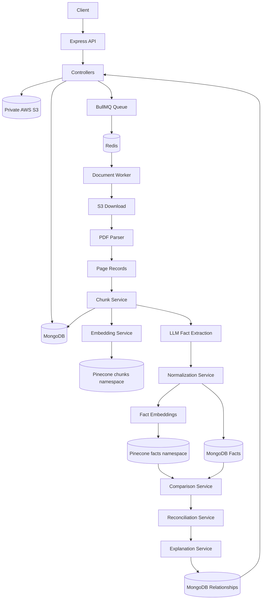
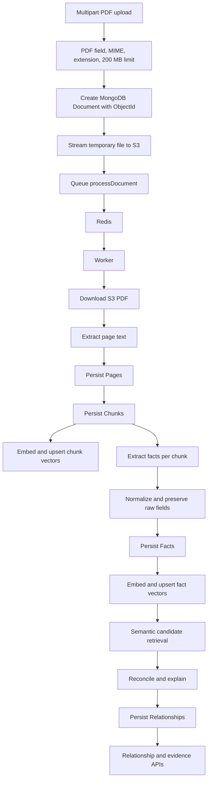
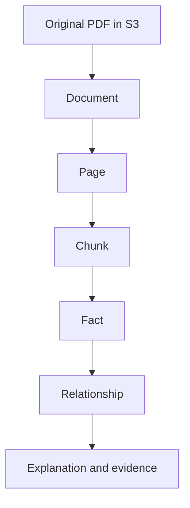
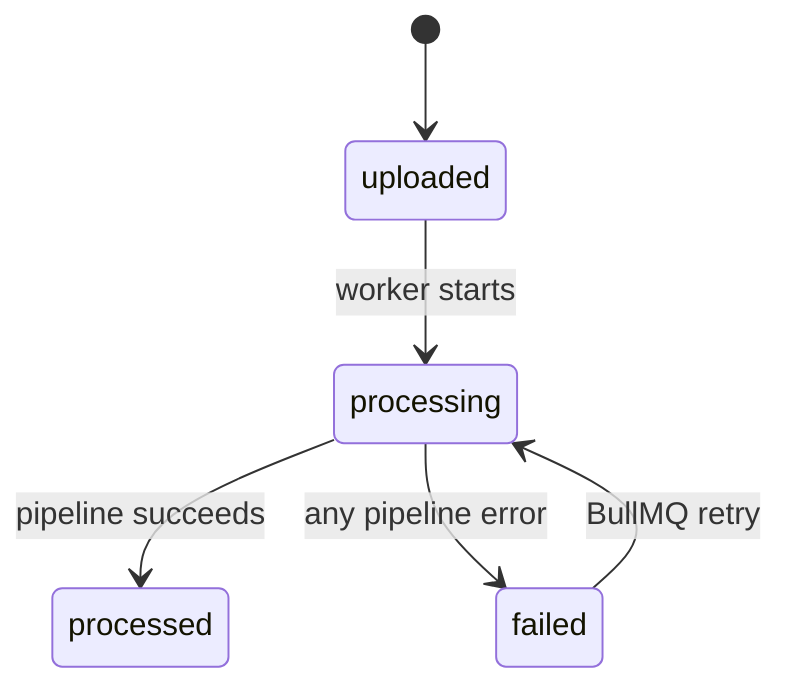

# FactLayer - Evidence-Grounded Fact Knowledge Layer

FactLayer extracts meaningful facts from PDFs, normalizes them, finds semantically related facts across documents, and records evidence-grounded classifications such as corroboration, contradiction, contextual difference, and uncertainty.

## Problem

PDF extraction alone produces disconnected text and numbers. FactLayer turns those documents into a structured knowledge layer where each fact remains linked to its document, page, chunk, and original source text.

This matters when wording differs. For example, `Revenue reached $120 million` and `The company generated USD 120M in sales` can be retrieved as candidate matches after normalization. Conversely, `FY2024 revenue was $100M` and `Q4 2024 revenue was $32M` can be retained as a contextual difference instead of being treated as an automatic contradiction.

## Core Capabilities

- PDF upload with filename, MIME type, extension, and size validation.
- Temporary disk-backed upload handling followed by private AWS S3 storage.
- Asynchronous processing with BullMQ, Redis, and a worker with concurrency `3`.
- Page-level text extraction and deterministic chunking.
- Chunk embeddings and semantic chunk retrieval through Pinecone.
- Structured LLM fact extraction with source-text validation.
- Flexible fact normalization for subjects, predicates, numbers, currencies, units, percentages, periods, dates, and scopes.
- Fact embeddings and semantic fact retrieval through Pinecone.
- Candidate matching using vector retrieval followed by deterministic compatibility checks.
- Reconciliation into `corroborated`, `contradiction`, `contextual_difference`, or `uncertain`.
- Evidence-grounded explanations with document, page, chunk, and source-text references.
- APIs for documents, pages, chunks, facts, semantic search, and relationships.

## Assignment Cases

### Corroboration

Document A: `FY2024 revenue reached $120 million.`

Document B: `The company generated $120M in fiscal 2024.`

After semantic retrieval and normalization, the system can see the same subject, metric, period, scope, currency, and value. When the normalized values are within the configured tolerance, the relationship is classified as `corroborated`.

### Contradiction

Document A: `Employee count was 4,200.`

Document B: `The company had 5,100 employees.`

When subject, predicate, period, scope, unit, and currency are compatible and normalized values differ materially, the relationship is classified as `contradiction`. Different periods or scopes are handled before this rule and are not automatically contradictions.

### Contextual Difference

Document A: `FY2024 revenue was $100M.`

Document B: `Q4 2024 revenue was $32M.`

The same metric can be present while the period differs. The system stores the period signal and classifies this as `contextual_difference`, rather than claiming the values conflict.

### Extraction and Reasoning Ambiguity

For `Revenue increased 25% to $100M`, the extraction prompt explicitly distinguishes the metric value from the change percentage: revenue is `$100M` and growth is `25%`. Extraction still depends on the LLM and source text, so ambiguous or unsupported responses can fail processing or result in an `uncertain` relationship. The implementation does not claim perfect extraction accuracy.

## System Design

The API request performs validation, creates the MongoDB document, streams the temporary upload into S3, queues a job, and returns. Parsing, embeddings, extraction, normalization, matching, reconciliation, and explanations run in the separate worker.



## Component Responsibilities

### Express API

`index.js` configures CORS, JSON parsing, the document/fact/relationship/evidence routes, the health endpoint, and error middleware. It connects MongoDB and Redis before listening. There is no authentication or authorization middleware.

### Controllers

Controllers validate request parameters, call services or models, and return the shared `ApiResponse` envelope. They do not call Pinecone, S3, or the LLM directly.

### Services

- `document.service.js`: creates document metadata, uploads and downloads S3 objects, runs the worker ingestion pipeline, cleans prior generated records on retry, and updates document status.
- `pdf.service.js`: extracts page-shaped text from a PDF buffer with `pdf-parse`.
- `chunk.service.js`: normalizes whitespace and splits page text into deterministic chunks of approximately 1,200 characters.
- `embedding.service.js`: creates OpenAI embeddings, upserts/deletes chunk and fact vectors, and queries Pinecone namespaces.
- `extraction.service.js`: requests structured JSON fact output from the configured OpenAI Chat Completions model and validates evidence, required fields, and confidence.
- `normalization.service.js`: creates raw-preserving canonical subject, predicate, value, unit, currency, percentage, period, and scope fields.
- `comparison.service.js`: queries semantic fact candidates and filters self-matches, same-document pairs, low similarity, and incompatible metrics.
- `reconciliation.service.js`: deterministically classifies candidate pairs and persists comparison signals and evidence.
- `explanation.service.js`: builds summaries, detailed reasons, similarities, differences, confidence, and evidence references from existing fact data.
- `evidence.service.js`: retrieves pages and chunks from MongoDB.
- `search.service.js`: queries Pinecone and hydrates canonical facts or chunks from MongoDB in Pinecone rank order.

### Models

- `Document`: uploaded PDF metadata, S3 key, status, counts, and processing error.
- `Page`: source-numbered extracted page text.
- `Chunk`: page-linked text segments and chunk vector IDs.
- `Fact`: raw extracted fields, normalized fields, confidence, and source references.
- `Relationship`: canonical fact pair, classification, scores, signals, explanation, and evidence.

### Queue and Worker

The `document-processing` BullMQ queue carries `processDocument` jobs containing `{ documentId }`. Jobs have three attempts with exponential backoff beginning at one second. Completed jobs are retained for one hour or 100 jobs; failed jobs for one day or 1,000 jobs. The worker runs with concurrency `3`.

### Storage

MongoDB is the canonical structured store for documents, pages, chunks, facts, relationships, and processing errors. S3 stores the original PDF at `documents/{documentId}/original.pdf`. Pinecone is only the semantic retrieval layer: chunk vectors use `PINECONE_NAMESPACE` or `factlayer`, while fact vectors always use `facts`.

## End-to-End Data Flow



## Evidence and Data Lineage



`documentId`, `pageId`, and `chunkId` are retained so a fact can be navigated back to the exact source path. Fact evidence includes document ID, page ID, page number when available, chunk ID, and source text. Relationship explanations include one evidence entry for Fact A and one for Fact B. The model contains `evidenceStart` and `evidenceEnd`, but the current extraction code does not populate those offsets.

## Data Model

All Mongoose models use timestamps and therefore also return `createdAt` and `updatedAt`. Mongoose also returns `_id` and `__v`.

### Document

| Field | Type | Required | Constraints / meaning |
|---|---|---:|---|
| `_id` | ObjectId | Yes | MongoDB identifier |
| `originalFileName` | String | Yes | Trimmed uploaded filename |
| `s3Key` | String | Yes | Unique S3 object key |
| `mimeType` | String | Yes | Enum: `application/pdf` |
| `fileSize` | Number | Yes | Uploaded byte size |
| `status` | String | Yes | `uploaded`, `processing`, `processed`, `failed`; indexed |
| `pageCount` | Number | No | Default `0` |
| `chunkCount` | Number | No | Default `0` |
| `processingError` | String/null | No | Error message or `null` |

### Page

| Field | Type | Required | Constraints / meaning |
|---|---|---:|---|
| `_id` | ObjectId | Yes | Page identifier |
| `documentId` | ObjectId | Yes | Refers to `Document`; indexed |
| `pageNumber` | Number | Yes | Source page number |
| `text` | String | No | Defaults to empty string |

Unique index: `{ documentId: 1, pageNumber: 1 }`.

### Chunk

| Field | Type | Required | Constraints / meaning |
|---|---|---:|---|
| `_id` | ObjectId | Yes | Chunk identifier |
| `documentId` | ObjectId | Yes | Refers to `Document`; indexed |
| `pageId` | ObjectId | Yes | Refers to `Page`; indexed |
| `pageNumber` | Number | Yes | Copied source page number |
| `chunkIndex` | Number | Yes | Deterministic order within page |
| `text` | String | Yes | Chunk text |
| `tokenCount` | Number | Yes | Whitespace word count, not tokenizer tokens |
| `vectorId` | String | Yes | Unique and indexed vector ID |

Unique index: `{ documentId: 1, pageNumber: 1, chunkIndex: 1 }`.

### Fact

Fact references are `documentId`, `pageId`, and `chunkId`, all required ObjectIds. Required semantic fields are `subject`, `predicate`, `sourceText`, `confidence` (`0..1`), and `extractionModel`.

| Field group | Fields and types |
|---|---|
| Identity/evidence | `documentId`, `pageId`, `chunkId`: ObjectId required; `pageNumber`: nullable Number; `sourceText`: required String; `evidenceStart`, `evidenceEnd`: nullable Number with minimum `0` |
| Raw extraction | `subject`, `predicate`: required String; `object`, `value`, `rawValue`: Mixed nullable; `valueType`, `unit`, `currency`, `period`, `scope`, `rawSubject`, `rawPredicate`, `rawUnit`, `rawCurrency`, `rawPeriod`, `rawScope`: nullable String |
| Period | `periodStart`, `periodEnd`, `normalizedPeriodStart`, `normalizedPeriodEnd`: nullable Date; `periodType`, `periodLabel`: nullable String |
| Normalized fields | `normalizedSubject`, `normalizedPredicate`, `normalizedUnit`, `normalizedCurrency`, `normalizedScope`: nullable String; `normalizedObject`: Mixed nullable; `normalizedValue`, `normalizedPercentage`: nullable Number |
| Quality | `confidence`: required Number `0..1`; `extractionModel`: required String |

Indexes exist on `documentId`, `pageId`, `chunkId`, `normalizedSubject`, `normalizedPredicate`, `normalizedCurrency`, and compound `{ documentId: 1, chunkId: 1 }`.

### Relationship

| Field | Type | Required | Constraints / meaning |
|---|---|---:|---|
| `factA` | ObjectId | Yes | Refers to `Fact` |
| `factB` | ObjectId | Yes | Refers to `Fact` |
| `relationshipType` | String | Yes | Enum listed below; default `candidate` |
| `similarityScore` | Number | Yes | `0..1`, Pinecone similarity |
| `matchingScore` | Number | Yes | `0..1`, compatibility-adjusted score |
| `confidence` | Number | Yes | `0..1` |
| `reason` | String | Yes | Deterministic reconciliation reason |
| `context` | String/null | No | Context difference description |
| `comparisonSignals` | Mixed | No | Subject, predicate, period, scope, unit, currency, value and semantic signals |
| `evidence` | Array of Mixed | No | Evidence entries for Fact A and Fact B |
| `summary` | String/null | No | Classification summary |
| `detailedReason` | String/null | No | Evidence-grounded explanation |
| `classification` | String/null | No | Mirrors the final relationship classification |
| `keyDifferences` | Array of String | No | Explainable differences |
| `keySimilarities` | Array of String | No | Explainable similarities |
| `status` | String | No | Default `pending`, indexed; worker sets `reviewed` after reconciliation |

Unique index: `{ factA: 1, factB: 1 }`.

## Vector Database

Chunks are embedded from chunk text and use IDs `chunk_{documentId}_{pageNumber}_{chunkIndex}`. Chunk metadata contains `documentId`, `pageId`, `pageNumber`, `chunkId`, `chunkIndex`, and text.

Facts are embedded from `sourceText` and use IDs `fact_{factId}`. Fact metadata contains fact/document/page/chunk IDs, subject, predicate, value, period, scope, and normalized comparison fields.

MongoDB remains the structured source of truth. Pinecone is queried to find semantic candidates, then the API hydrates the canonical MongoDB record. Pinecone matches without a valid MongoDB record are dropped.

## Asynchronous Processing and States



The HTTP upload returns after S3 storage and job creation; it does not wait for parsing, embeddings, LLM extraction, or reconciliation. A failed job is retried up to three attempts. Before retry processing, prior generated pages, chunks, facts, vectors, and relationships for that document are removed or replaced. Cleanup is not transactional, and same-document worker jobs are not locked or deduplicated.

## Technology Stack

| Technology | Purpose |
|---|---|
| Node.js | Backend runtime |
| Express | HTTP API |
| MongoDB | Canonical structured persistence |
| Mongoose | MongoDB ODM and schemas |
| AWS SDK v3 / S3 | Original PDF storage |
| Multer | Multipart upload handling |
| Redis | BullMQ connection backend |
| BullMQ | Asynchronous document jobs and retries |
| `pdf-parse` | PDF text extraction |
| OpenAI embeddings API | Chunk and fact embeddings |
| OpenAI Chat Completions API | Structured fact extraction |
| Pinecone SDK | Semantic vector storage and retrieval |
| dotenv | Environment configuration |
| CORS | Cross-origin HTTP middleware |

## Key Design Decisions

- MongoDB is flexible enough for arbitrary fact types while preserving document/page/chunk relationships.
- S3 keeps original PDFs outside MongoDB and uses `documents/{documentId}/original.pdf`.
- BullMQ and Redis keep expensive parsing, embeddings, LLM calls, and reconciliation out of the upload request.
- Pinecone handles semantic retrieval; it does not replace MongoDB.
- Page and chunk identifiers preserve auditable evidence lineage.
- Deterministic normalization and reconciliation run before any future probabilistic extension, making current classifications inspectable.
- Raw fact fields are retained alongside normalized fields so normalization does not erase source representation.

## Security and Error Handling

- Credentials and connection strings are read from environment variables; `.env` is git-ignored.
- S3 access is performed through the AWS SDK and no public S3 URLs are returned. Bucket privacy policy itself is external configuration and is not enforced in application code.
- Uploads must use the `document` multipart field, `application/pdf` MIME type, and a `.pdf` filename; the limit is 200 MB. File content is not independently magic-number validated.
- No authentication or authorization is implemented.
- Errors use the API response envelope, but unknown Express routes are not converted by the error middleware.
- Multer errors return `400`; invalid IDs and missing request fields return `400`; missing resources return `404`; provider and worker failures normally return `500` and may expose the underlying error message.

## Testing

Tests use Node's built-in `node:test` runner and run with `npm test`.

- `tests/extraction.test.js`: PDF output shape, structured extraction, evidence validation, confidence, malformed output.
- `tests/chunking.test.js`: deterministic ordering, page metadata, and no empty chunks.
- `tests/normalization.test.js`: numbers, currencies, units, percentages, fiscal periods, aliases, scopes, raw preservation, idempotency.
- `tests/comparison.test.js`: semantic candidate filtering, same-document/self-match prevention, canonical pair ordering.
- `tests/reconciliation.test.js`: corroboration, contradiction, contextual difference, uncertainty, and missing evidence.

There are no live API, MongoDB, Redis, S3, Pinecone, worker, or queue integration tests in the repository.

## Running Locally

Requirements: Node.js 20 or newer, MongoDB, Redis, an S3 bucket, a Pinecone index, an OpenAI API key, and reachable credentials/configuration for each service.

```sh
cp .env.example .env
npm install
npm test
npm run start-server
npm run start-worker
npm run dev
```

`start-server` runs only the API. `start-worker` runs only the BullMQ worker. `dev` starts both with `concurrently`.

Required environment variables are documented in `.env.example`: `PORT`, `MONGO_URI`, `REDIS_URL`, AWS settings, Pinecone settings, `EMBEDDING_MODEL`, `OPENAI_API_KEY`, `EMBEDDING_DIMENSION`, and `FACT_EXTRACTION_MODEL`. `VECTOR_DB_PROVIDER` is present in the example configuration but is not read by the current implementation. `EMBEDDING_DIMENSION` is also not validated by application code; the Pinecone index dimension must still match the embedding model externally.

## API Overview

| Method | Endpoint | Purpose |
|---|---|---|
| GET | `/health` | Health response |
| POST | `/api/documents/upload` | Upload a PDF |
| GET | `/api/documents/:documentId` | Get document metadata/status |
| GET | `/api/documents/:documentId/pages` | List pages |
| GET | `/api/documents/:documentId/chunks` | List chunks |
| GET | `/api/pages/:pageId` | Get one page |
| GET | `/api/chunks/:chunkId` | Get one chunk with source references |
| GET | `/api/facts/document/:documentId` | List document facts |
| GET | `/api/facts/search?q=...&topK=...` | Semantic fact search |
| GET | `/api/facts/:factId` | Get one fact with evidence |
| GET | `/api/search/chunks?q=...&topK=...` | Semantic chunk search |
| GET | `/api/relationships/document/:documentId` | List document relationships |
| GET | `/api/relationships/:relationshipId` | Get one relationship |

See [API.md](API.md) for the complete contract.

## Limitations

- Scanned/image-only PDFs are not OCR-processed.
- `pdf-parse` parsing still loads the downloaded PDF into memory after disk-backed upload/S3 storage.
- Tables and unusual PDF layouts may extract poorly.
- LLM extraction can fail or produce false positives; source-text validation reduces but does not eliminate that risk.
- `tokenCount` is a whitespace word count rather than a model tokenizer count.
- Evidence offsets are defined but not populated.
- Semantic similarity is candidate discovery, not proof.
- Ambiguous subjects and missing periods/scopes can lead to `uncertain` results or imperfect classification.
- Worker jobs for the same document are not locked or deduplicated.
- There is no pagination on collection endpoints.

## Future Improvements

- OCR and stronger table extraction.
- Streaming PDF parsing or bounded-memory parser processing.
- Document-level job locks and queue deduplication.
- Authentication and authorization.
- Pagination, filtering, and richer natural-language search.
- Confidence calibration and evaluation datasets.
- Stronger entity resolution and period-aware comparison.
- Frontend visualization and timeline views.

## Why This Architecture

FactLayer separates original-file storage, canonical structured data, asynchronous processing, semantic retrieval, extraction, normalization, comparison, reconciliation, and evidence presentation. That separation keeps MongoDB authoritative, makes long-running work retryable, preserves source lineage, and allows retrieval or presentation layers to evolve without moving reasoning into the vector database or a graph store.
