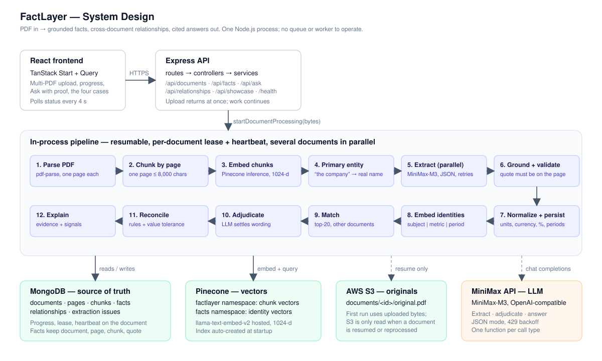
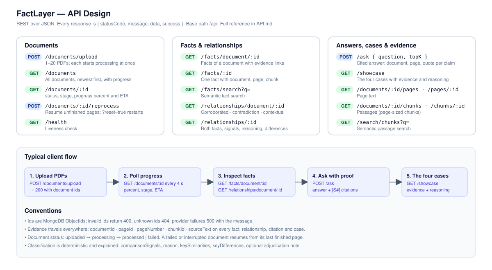

# FactLayer

**A fact knowledge layer for PDFs.** Upload documents, and FactLayer extracts the facts inside them, keeps every fact tied to the exact page and sentence it came from, matches facts across documents, and explains whether they corroborate, contradict, or merely differ in context. Ask a question and get an answer with citations.

Built for the Superjoin engineering intern assignment.

| | |
|---|---|
| **Live app** | https://factlyerfrontend.vercel.app/ |
| **Video demo** | [3-minute walkthrough](https://drive.google.com/file/d/1jyWeNXmoHA19NYgqz-H0asjIIY6ZJUTa/view?usp=sharing) |
| **Frontend repository** | [JosephRemingston/rausch-round](https://github.com/JosephRemingston/rausch-round) |
| **Stack** | Node.js 20 · Express 5 · MongoDB · Pinecone · AWS S3 · MiniMax-M3 with Gemini fallback · React (TanStack Start) |
| **Tests** | `npm test` — 53 unit tests, no external services required |
| **Documents** | [API reference](API.md) · [System design](docs/system-design.svg) · [API design](docs/api-design.svg) |

---

## What it does

1. **Extracts grounded facts.** Each page goes to the model with a strict schema. Every returned fact must quote a span that actually exists on that page, or it is rejected and recorded as evidence of the failure.
2. **Links facts across documents.** Facts are embedded by identity ("Delhivery | revenue | FY24 | consolidated"), matched across documents, and classified by deterministic rules. Near-miss wording is settled by an LLM adjudicator before the rules run.
3. **Answers with proof.** `POST /api/ask` returns a short answer where every claim carries a `[S#]` citation resolving to the document name, page number and verbatim quote.
4. **Shows its work.** `GET /api/showcase` and the Cases page surface the best real example of each assignment case, including the extraction failures the pipeline caught.

---

## Setup and Run Instructions

**Requirements:** Node.js 20 or newer, MongoDB, an AWS S3 bucket, a Pinecone API key, and a MiniMax API key. A Gemini API key is optional but recommended, since the two providers cover each other's rate limits.

```bash
git clone https://github.com/JosephRemingston/factlayer.git
cd factlayer
npm install
cp .env.example .env      # then fill in the values below
npm start                 # API and processing on http://localhost:3000
```

`npm run dev` runs the same with file watching, and `npm test` runs the unit tests.

**Required environment variables**

| Variable | Purpose |
|---|---|
| `MONGO_URI` | MongoDB connection string |
| `AWS_REGION`, `AWS_BUCKET_NAME`, `AWS_ACCESS_KEY_ID`, `AWS_SECRET_ACCESS_KEY` | Original PDF storage |
| `PINECONE_API_KEY`, `PINECONE_INDEX_NAME` | Vector index; created automatically at `EMBEDDING_DIMENSION` if missing |
| `MINIMAX_API_KEY` | Primary model for extraction, adjudication and answers |
| `GEMINI_API_KEY` | Fallback model, used automatically while MiniMax is rate limited |

**Optional tuning**, with defaults in `.env.example`: `EMBEDDING_PROVIDER`, `EMBEDDING_DIMENSION`, `LLM_PROVIDER`, `FACT_EXTRACTION_MODEL`, `GEMINI_MODEL`, `PROCESSING_CONCURRENCY`, `EXTRACTION_CONCURRENCY`, `MATCHING_CONCURRENCY`, `ASK_RATE_MAX`, `UPLOAD_RATE_MAX`, `ALLOWED_ORIGINS`, `UPLOAD_DIR`.

One-time S3 setup so the browser can upload directly to storage:

```bash
node scripts/configure-s3-cors.mjs
```

**Frontend**

```bash
git clone https://github.com/JosephRemingston/rausch-round.git
cd rausch-round
npm install
echo "VITE_API_BASE=http://localhost:3000" > .env
npm run dev               # http://localhost:8080
```

Open the app, enter any name to create a workspace, and upload the sample PDFs from `data/starter-datasets/`. The `delhivery/` set produces all four required cases. `india-macroeconomy/` is a harder second set where three institutions describe the same economy.

**Deploying.** The frontend has a `vercel.json` and deploys to Vercel as-is; set `VITE_API_BASE` to your API URL. The backend needs a host that keeps a process alive, such as Render, Railway, Fly.io or a VM, because it keeps working for minutes after the upload response returns. See [Limitations](#limitations-and-next-steps) for why serverless does not fit.

---

## Video Demo

**[Watch the 3-minute demo](https://drive.google.com/file/d/1jyWeNXmoHA19NYgqz-H0asjIIY6ZJUTa/view?usp=sharing)** — a PDF being processed, and each of the four required cases with its evidence.

The same examples are reproducible live at https://factlyerfrontend.vercel.app/ under the **Cases** tab, which is generated from whatever documents a workspace holds rather than hard-coded.

---

## Approach

### The problem, restated

A PDF gives you text. What you actually want is: *what does this document claim, where exactly does it say so, and does anything else I have agree or disagree?* Every decision below follows from treating **evidence as mandatory** rather than as a nice-to-have.

### Architecture



Upload stores the PDF in S3 and returns immediately. Processing continues in the same Node process and is resumable: pages and chunks are written once, every chunk records its own extraction status, and facts are persisted per page. A crash, restart or rate-limit failure resumes from the last finished page instead of restarting the document.

The pipeline, per document:

| Stage | What happens |
|---|---|
| Parse and chunk | One record per page; a page is one chunk unless it exceeds 8,000 characters. Boilerplate pages are skipped. |
| Embed chunks | Pinecone-hosted `llama-text-embed-v2`, 1024 dimensions, batched by estimated tokens |
| Primary entity | One model call on the opening pages identifies the organization the document is about |
| Extract facts | 12 pages in parallel, JSON mode, fixed schema |
| Ground and validate | The quoted span must exist on the page, or the fact is rejected and recorded |
| Normalize | Canonical subject, predicate, magnitude, currency, percentage, period and scope, with raw values preserved |
| Match | Each fact's identity string is queried against other documents' facts, 16 queries in parallel |
| Adjudicate | Strongly similar pairs whose wording differs go to the model in batches of 20 |
| Reconcile and explain | Deterministic rules produce the classification, reason, signals and differences |

### How the four cases are produced

| Case | Mechanism |
|---|---|
| Corroborated, expressed differently | Identity embeddings find the pair, the adjudicator confirms the wording means the same metric, values agree within 1 percent |
| Genuine contradiction | Same subject, metric and period, scope not contradicted, values differ beyond tolerance |
| Explained by context | Same metric, but period, scope, unit or currency differs; never reported as a contradiction |
| Extraction failure | Every rejected candidate, repaired reply and skipped page is stored with its reason and handling |

Real examples from the sample set, selected automatically by `GET /api/showcase`:

- **Corroborated.** "Amit Agarwal is the Chief Financial Officer of our Company" (prospectus, page 97) against "Amit Agarwal, Chief Financial Officer of Delhivery Limited" (annual report, page 50). Different subject wording, joined by the adjudicator.
- **Contradiction.** Adjusted EBITDA for FY23: ₹(217) crore in the Q4 presentation, page 13, against ₹(4,038.66) million in the annual report, page 37. Same metric, same period, values differ by 46 percent.
- **Contextual difference.** Total assets of ₹45,977.98 million as at March 2021 against ₹114,530.20 million as at March 2024. Same metric, different period, correctly not a contradiction.

### Measured results

Three sample PDFs, 227 pages, on live infrastructure:

| Metric | Value |
|---|---|
| Facts extracted | 2,812 |
| Relationships classified | 790 — 98 corroborated, 6 contradictions, 531 contextual, 112 uncertain |
| Relationships that exist only because of LLM adjudication | 131 |
| Extraction failures caught and recorded | 208 |
| Pages that failed extraction | 0 |
| Answer latency | 6.7 to 9.2 seconds |

### Decisions and trade-offs

Each of these was measured rather than assumed.

**Page-level chunks instead of 1,200-character chunks.** Chunk size drives the model-call count, which dominates both cost and time.

| | 1,200 chars | Page level |
|---|---|---|
| Prospectus | 312 chunks | 100 chunks |
| RBI excerpt | 269 chunks | 100 chunks |

*Why:* roughly 68 percent fewer model calls, and a citation that points at one page rather than a fragment. *Cost:* passage search now returns a whole page, so it is coarser. Evidence precision is unaffected, because each fact still carries its own quoted sentence.

**Two providers instead of one.** A rate-limited provider hands the same request to the other. Because a call is one page or one batch, the switch resumes exactly where the first provider stopped.

| Configuration | 100-page extraction | Pages lost |
|---|---|---|
| 8 parallel, one provider | ~3.5 min | 0 |
| 20 parallel, two providers | ~2.5 min | 1 |
| 12 parallel, two providers, wait budget | ~2.5 to 3 min | 0 |

One 100-page run made 15 provider switches, splitting the work 1,023 facts from MiniMax against 65 from Gemini. *Why:* free tiers throttle unpredictably, and a second provider converts a stall into a switch. *Cost:* pushing to 20 parallel bought 30 percent speed but lost a page when both providers were parked at the same moment. A rate limit is a delay rather than a failure, so a call now keeps cycling providers within a budget, and the pool sits at 12. Losing evidence to buy speed is the wrong trade for this system.

**Deterministic classification, model-assisted matching.** The model extracts facts and judges wording; rules decide corroboration and contradiction. *Why:* the assignment asks to see the system's reasoning, and rules are explainable and unit-testable. *Cost:* rules miss relationships a model might notice, and every threshold is a place a reviewer can disagree.

**Evidence is mandatory.** A fact whose quote does not appear on its page is rejected rather than stored with lower confidence.

| Matching strategy | Rejection rate |
|---|---|
| Exact string match | 13 percent |
| Ignoring punctuation, quote style, hyphenation, number spacing | 6 percent |

*Why:* an ungrounded fact is worse than a missing one, because it looks trustworthy. *Cost:* some real facts are still lost to paraphrasing. The rejections are kept and become the evidence for case four.

**Background work in the API process instead of a queue.** The project began with BullMQ and Redis; removing them cut two services and a deployment step. A per-document lease with a heartbeat prevents double processing, and per-page persistence gives crash recovery, which is what the queue was providing. *Cost:* horizontal scaling would need a shared queue again.

**In-process rate limiting.** Model-backed endpoints are capped per workspace at 10 questions and 10 uploads per minute. *Why:* one tester should not exhaust shared provider quota for everyone. *Cost:* counters are per-instance and reset on restart, which is correct for one process and wrong for many.

**Named workspaces instead of accounts.** A person enters a name and their documents live under it, isolated down to separate Pinecone namespaces. *Why:* a reviewer can close the tab and come back to their own documents without a signup flow. *Cost:* there is no password, so it separates testers rather than protecting data. The sign-in screen says so plainly.

**Direct-to-S3 uploads.** The browser requests a presigned URL and sends the file straight to storage. *Why:* it removes the host's request-body limit entirely; Vercel rejects anything over 4.5 MB and one sample PDF is 6.4 MB. *Cost:* one extra round trip and a bucket CORS rule.

### Bugs found by testing end to end

Four defects appeared only under real load. Each is now covered by a regression test.

| Bug | Effect | Fix |
|---|---|---|
| Fixed batch of 64 page-sized chunks | ~128k tokens per request exceeded Pinecone's 250k per minute, and a document failed after six retries | Token-aware batching plus a process-wide sliding-window limiter |
| Resume skipped chunk embedding | A document that failed while embedding resumed straight to extraction and was silently absent from passage search | Embedding completion tracked on the document |
| Identifiers compared as numbers | Two different corporate identity numbers both reduced to `63090` and were reported as corroborated | Identifier-shaped values are no longer coerced to numbers |
| Indian magnitudes missing | "8,142 crore" normalized to 8,142 rather than 81.42 billion | `crore` and `lakh` added to the magnitude table |

The last two changed the output materially:

| | Before | After |
|---|---|---|
| Corroborated | 45 | 98 |
| Contradictions | **0** | **6** |

Case two had no example at all before that fix, and the assignment requires one.

### AI tools used

Claude Code, running Claude Opus 5 and Claude Fable 5.1, was used as a pair programmer throughout: design discussion, implementation, debugging against live services, and this documentation. At runtime the system calls MiniMax-M3 for extraction, adjudication and answers, with Gemini 2.5 Flash as the fallback, and Pinecone-hosted `llama-text-embed-v2` for embeddings.

---

## API design



Full request and response shapes are in [API.md](API.md). Every `/api` request carries the workspace name in the `x-factlayer-user` header.

| Endpoint | Purpose |
|---|---|
| `POST /api/documents/upload-url` · `POST /api/documents/:id/uploaded` | Direct-to-S3 upload, no request-body limit |
| `POST /api/documents/upload` | Upload 1 to 20 PDFs through the API |
| `GET /api/documents` · `GET /api/documents/:id` | Documents with a live `progress` object |
| `POST /api/documents/:id/reprocess` | Resume unfinished pages, or `?reset=true` to start over |
| `GET /api/facts/document/:id` · `GET /api/facts/:id` · `GET /api/facts/search?q=` | Facts with evidence links, and semantic search |
| `GET /api/relationships/document/:id` · `GET /api/relationships/:id` | Classified relationships with reasoning |
| `POST /api/ask` | Cited answer across all documents (rate limited) |
| `GET /api/showcase` | The four cases with evidence |
| `GET /api/providers` | Model provider availability and cooldowns |
| `GET /health` | Liveness |

---

## Data model

| Collection | Holds | Evidence fields |
|---|---|---|
| `documents` | Workspace, file metadata, status, stage, progress, primary entity, processing lease | `s3Key` |
| `pages` | Page number and text | `documentId` |
| `chunks` | Page-sized text, extraction status, vector id | `documentId`, `pageId`, `pageNumber` |
| `facts` | Raw and normalized subject, predicate, value, unit, currency, period, scope, confidence | `documentId`, `pageId`, `chunkId`, `pageNumber`, `sourceText` |
| `relationships` | Fact pair, classification, scores, signals, reasoning | Evidence entry per fact |
| `extractionissues` | Failure type, rejected candidate, and the handling applied | `documentId`, `chunkId`, `pageNumber` |

MongoDB is the source of truth. Pinecone holds chunk vectors and fact-identity vectors in per-workspace namespaces and is used only to find candidates, which are then hydrated from MongoDB.

---

## Testing

`npm test` runs 53 tests with Node's built-in runner and no external services:

- chunking determinism and page metadata
- evidence grounding, including quote-style, hyphenation and number-spacing tolerance, and rejection of altered evidence
- unit, currency, percentage and period normalization, including idempotence and identifier rejection
- candidate comparison, self and same-document rejection, value-type compatibility
- adjudicator overrides and descriptive-fact contradictions
- reconciliation outcomes for equal, contradictory and context-differing facts
- provider failover: switching on a rate limit, skipping a parked provider, recovering when both are limited, and not masking real errors
- rate limiter burst, refusal and per-workspace budgets
- workspace name rules and per-workspace vector namespaces
- CORS origin rules, including look-alike domains
- PDF runtime portability without the native canvas package

End-to-end behaviour was verified by uploading the three starter PDFs against live MongoDB, S3, Pinecone, MiniMax and Gemini.

---

## Limitations and Next Steps

**What does not work yet**

- **Facts without a stated period** are classified `uncertain` when values differ, because a change over time cannot be distinguished from a contradiction. This is the largest single source of missed contradictions.
- **Passage search returns whole pages**, a direct consequence of page-level chunking.
- **Rate limits set the pace.** Two free tiers together still park simultaneously under load, so extraction speed is a function of the plan rather than the pipeline.
- **Adjudication is capped** at 400 pairs per document to bound cost, so some corroborations in large documents are never examined.
- **Workspaces are names, not accounts.** No password, and CORS is open to any Vercel origin.
- **Single process.** Multiple API instances would need a shared queue; the lease prevents double processing but does not distribute work.
- **Serverless does not fit.** The API keeps processing for minutes after responding, holds leases and cooldowns in memory, and resumes on startup. On Vercel or Lambda an upload reports success and never finishes. Read endpoints work; ingestion does not.

**What I would build next, in order**

1. **Infer periods from context.** Read the surrounding heading and the document's own reporting date so a value without an explicit period can still be compared. This turns the 112 `uncertain` relationships into real classifications and is the highest-value change on the list.
2. **A fuzzy evidence span search.** Edit-distance matching would recover the paraphrased quotes the 6 percent rejection rate still discards, without weakening the guarantee that evidence exists on the page.
3. **A secondary paragraph index** so passage search is precise while facts keep page-level citations.
4. **Structured outputs** where the provider supports them, removing the malformed-JSON repair path entirely.
5. **A per-document alias table** for subsidiaries and segments, cutting adjudication calls and cost.
6. **A shared queue** if the API ever needs more than one instance.

---

## Additional Notes

**On being wrong loudly.** The system is built to fail visibly rather than quietly. A fact whose quote is not on the page is dropped, not down-weighted. A page that cannot be extracted is recorded and skipped, and the document still completes with a note. Values that differ without a comparable period are marked uncertain rather than called contradictions. The 208 recorded extraction issues are not something to hide; they are case four.

**On the contradiction that may be a definition difference.** The Adjusted EBITDA example, ₹(217) crore against ₹(4,038.66) million for FY23, could be two different definitions of the metric rather than an error in either document. The system flags it with both quotes and both page numbers and lets a person judge. That is deliberate: surface the conflict with evidence, do not adjudicate the underlying accounting.

**On the sample data.** `data/starter-datasets/delhivery/` produces all four cases. `data/starter-datasets/india-macroeconomy/` is harder: the Economic Survey, the RBI annual report and an IMF Article IV describe the same economy using different fiscal-year conventions, which stresses period normalization considerably more.

**On running costs.** Both model providers are on free or entry tiers, so processing is rate limited rather than compute limited. A paid key on either provider removes the ceiling and nothing in the code changes.

**Repository layout**

```
index.js                      Express app; resumes interrupted documents on start
routes/ controllers/          documents, facts, relationships, evidence, ask, showcase
services/
  document.service.js         resumable pipeline, lease and heartbeat, progress
  pdf.service.js              page extraction
  chunk.service.js            page-level chunking
  llm.service.js              provider layer with rate-limit failover
  extraction.service.js       prompts, grounding, validation, adjudication
  normalization.service.js    canonical subjects, values, periods, scopes
  embedding.service.js        Pinecone index, hosted embeddings, token budget
  comparison.service.js       candidate matching and adjudication pass
  reconciliation.service.js   classification rules
  explanation.service.js      human-readable reasoning
  answer.service.js           cited answers
  showcase.service.js         the four cases
middlewares/                  workspace, rate limits, uploads, errors
models/                       Mongoose schemas including ExtractionIssue
utils/                        retry with provider-aware backoff, concurrency, normalizers, PDF polyfills
scripts/configure-s3-cors.mjs one-time bucket setup for direct uploads
tests/                        node --test suites
docs/                         system-design.svg, api-design.svg
data/starter-datasets/        sample PDFs
```
